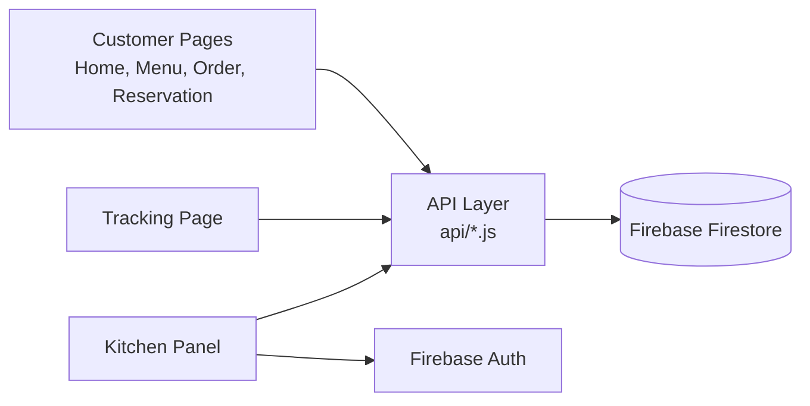

<!-- File: README.md | Owner: Leader | Project info -->
# Khabar Khoj

A premium steakhouse website with online ordering, live order tracking, table reservations, and a kitchen admin panel. Built as a group project for the Web Programming course.

---

## Introduction

Khabar Khoj presents a restaurant's story, menu, events, and ingredients in a dark, elegant design with animations, smooth transitions, and glassmorphism. Customers can browse dishes, place an order (dine in, pickup, or delivery), and follow its progress in real time. Staff manage everything from a single kitchen panel that tracks orders, tables, amounts, food status, and total earnings.

---

## Features

**Customer side**
- Responsive pages with scroll animations, page transitions, and glassmorphism UI
- Menu split into segments (Starters, Main Course, Desserts, Drinks, Set Menu)
- Dish cards with price, short description, and an Order button
- Cart, quantity selection, and order type: Dine In, Pickup, or Delivery
- Live order tracking
- Table reservation form for individuals or events
- Contact information and location

**Kitchen / admin side**
- Secure kitchen login (single admin panel)
- Live list of incoming orders
- Order details: items, table number, amount, order type
- Food status control: Received → Preparing → Ready → Delivered
- Earnings summary: total, today, this week, this month
- Reservation list

---

## Pages

| # | Page | Folder | Description |
|---|------|--------|-------------|
| 1 | Home | `pages/01-home` | Hero section with restaurant name, tagline, and Book a Table button |
| 2 | Our Story | `pages/02-story` | Restaurant background and values |
| 3 | Menu | `pages/03-menu` | Segmented menu, dish details, Order button |
| 4 | Events & Gallery | `pages/04-events-gallery` | Upcoming events and photo gallery |
| 5 | Ingredients | `pages/05-ingredients` | Showcase of the ingredients used |
| 6 | Reservation & Contact | `pages/06-reservation-contact` | Table booking form, address, working hours, contact info |
| 7 | Order, Cart, Checkout | `ordering/` | Quantity, order type, cart review, confirmation |
| 8 | Order Tracking | `tracking/` | Live status of the customer's order |
| 9 | Kitchen Panel | `kitchen/` | Login, dashboard, earnings, reservations |

---

## How It Works

1. The customer opens the **Menu** and picks a segment.
2. Clicking a dish and pressing **Order** opens the order page.
3. The customer selects quantity and **Dine In / Pickup / Delivery**, then checks out.
4. The order is saved with the status `received` and the customer is sent to the **Tracking** page.
5. The kitchen sees the order instantly on the **Dashboard** and updates the status.
6. The tracking page updates live as the status changes.
7. Delivered orders are added to the **Earnings** totals.

**Order statuses:** `received` → `preparing` → `ready` → `delivered`

---

## System Structure



Pages never talk to the database directly. They call functions in the `api/` folder, which read from and write to Firebase.

### API functions

| Function | File | Used by | Purpose |
|----------|------|---------|---------|
| `getMenu(category)` | `menu-api.js` | Menu page | Load dishes |
| `createOrder(items, type, table)` | `order-api.js` | Checkout | Save a new order |
| `listenToOrder(orderId)` | `tracking-api.js` | Tracking page | Live status updates |
| `createReservation(data)` | `reservation-api.js` | Reservation page | Save a booking |
| `listenToOrders()` | `kitchen-api.js` | Dashboard | Live list of all orders |
| `updateStatus(orderId, status)` | `kitchen-api.js` | Dashboard | Change order status |
| `getEarnings(range)` | `kitchen-api.js` | Earnings page | Sum totals of delivered orders |

### Database collections

| Collection | Main fields |
|------------|-------------|
| `menu` | name, category, price, description, image |
| `orders` | items, quantity, total, type, table, status, createdAt |
| `reservations` | name, phone, date, time, guests, note |

---

## Folder Structure

```
KHABAR-KHOJ/
├── index.html
├── pages/
│   ├── 01-home/
│   ├── 02-story/
│   ├── 03-menu/
│   ├── 04-events-gallery/
│   ├── 05-ingredients/
│   └── 06-reservation-contact/
├── ordering/          # order, cart, checkout, order-success
├── tracking/          # customer order tracking
├── kitchen/           # login, dashboard, earnings, reservations
├── shared/
│   ├── components/    # navbar, footer, toast, modal
│   ├── css/           # variables, global, animations, glassmorphism
│   └── js/            # common, scroll-animations, cart-store
├── api/               # one file per feature
├── database/          # firebase setup, seed data, rules
├── assets/            # images, icons, logo, fonts, qr
└── docs/              # requirements, design, API documentation
```

Each page folder holds its own `.html`, `.css`, and `.js` file with the same name.

---

## Tools and Technologies

| Purpose | Tool |
|---------|------|
| Structure | HTML5 |
| Styling | CSS3 (animations, transitions, glassmorphism) |
| Logic | JavaScript (ES6) |
| Database | Firebase Firestore (real-time) |
| Authentication | Firebase Authentication (kitchen login) |
| Code editor | Visual Studio Code |
| Version control | Git and GitHub |
| Design reference | Figma / dark steakhouse UI reference |

---

## Team

| Member | Responsibility |
|--------|----------------|
| Team Leader | Kitchen panel, earnings, database setup, final integration |
| Member 2 | Shared design system, Home, Our Story |
| Member 3 | Menu, food details, order tracking |
| Member 4 | Ordering, cart, checkout |
| Member 5 | Events/Gallery, Ingredients, Reservation and Contact |

---

## Getting Started

```bash
git clone https://github.com/zarinanjumsohana/Khabar-Khoj.git
cd Khabar-Khoj
```

Open `index.html` with the VS Code **Live Server** extension.

### Git workflow

- Each member works on their own branch, e.g. `feature/menu`, `feature/kitchen`.
- Commit messages are short and in present tense: `Add menu page layout`.
- Finished work is merged into `main` through a pull request.
- Secrets such as Firebase keys go in `.env` and are never committed.

---

## Naming Conventions

- Folders and files: lowercase `kebab-case`
- API files end with `-api.js`
- Images: descriptive names such as `ribeye-steak.jpg`
- Order statuses: `received`, `preparing`, `ready`, `delivered`

---

## Course

Web Programming Laboratory, 3rd Year 1st Semester.
