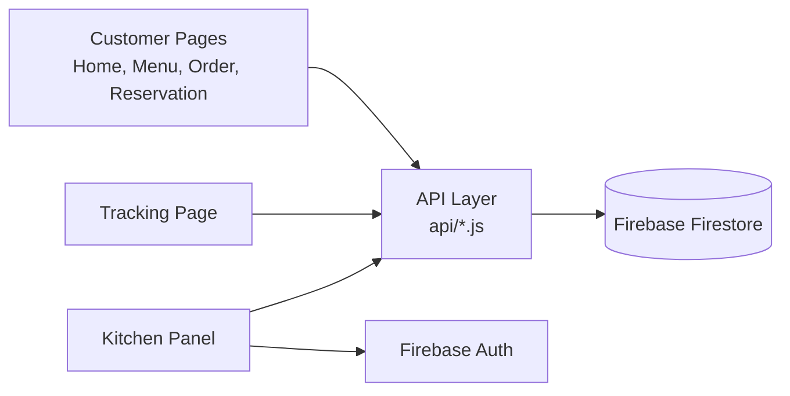

<!-- File: README.md | Owner: Leader | Project info -->
# Khabar Khoj

Khabar Khoj has two parts: a navigation website for finding nearby restaurants, and a full restaurant website for browsing the menu, ordering, and contacting the restaurant.

---

## Introduction

### Part 1: Khabar Khoj (Navigation)
Khabar Khoj is a location-based web app that helps users discover restaurants near them. It detects the user's location, shows nearby restaurants on an interactive map, and provides directions to the one they choose. Finding a good place to eat takes just a few clicks.

### Part 2: Restaurant Website
A complete website for a single resturant. Customers can explore the menu, add items to cart, place an order online and get in touch with the resturant directly.


---

## Features

(PART-1)
**Navigator**
-  Automatic detection of the user's current location
-  Interactive map with nearby restaurant markers
-  Distance shown for each restaurant
-  Search restaurants by name or cuisine
-  Filter by distance, rating, and cuisine type
-  Turn-by-turn directions to the selected restaurant
-  Restaurant detail card (address, phone, opening hours, rating)

(PART-2)
**Customer side**
- Responsive pages with scroll animations, page transitions, and glassmorphism UI
- Menu split into segments (Starters, Main Course, Desserts, Drinks, Set Menu)
- Dish cards with price, short description, and an Order button
- Cart, quantity selection, and order type: Dine In, Pickup, or Delivery
- Live order tracking
- Table reservation form for individuals or events
- Contact information and location

**Kitchen / admin side**
- Secure kitchen login (single admin panel)
- Live list of incoming orders
- Order details: items, table number, amount, order type
- Food status control: Received → Preparing → Ready → Delivered
- Earnings summary: total, today, this week, this month
- Reservation list

---

## Pages

| # | Page | Folder | Description |
|---|------|--------|-------------|
| 1 | Home | `pages/01-home` | Hero section with restaurant name, tagline, and Book a Table button |
| 2 | Our Story | `pages/02-story` | Restaurant background and values |
| 3 | Menu | `pages/03-menu` | Segmented menu, dish details, Order button |
| 4 | Events & Gallery | `pages/04-events-gallery` | Upcoming events and photo gallery |
| 5 | Ingredients | `pages/05-ingredients` | Showcase of the ingredients used |
| 6 | Reservation & Contact | `pages/06-reservation-contact` | Table booking form, address, working hours, contact info |
| 7 | Order, Cart, Checkout | `ordering/` | Quantity, order type, cart review, confirmation |
| 8 | Order Tracking | `tracking/` | Live status of the customer's order |
| 9 | Kitchen Panel | `kitchen/` | Login, dashboard, earnings, reservations |

---

## How It Works

(PART-1)
1. The user opens the website and allows location access.
2. The browser's Geolocation API returns the user's coordinates.
3. The app requests nearby restaurants from the backend using those coordinates.
4. The backend queries the database and returns restaurants within the chosen radius.
5. Results appear as markers on the map and as a list.
6. The user selects a restaurant to view its details and get directions
   
(PART-2)
1. The customer opens the **Menu** and picks a segment.
2. Clicking a dish and pressing **Order** opens the order page.
3. The customer selects quantity and **Dine In / Pickup / Delivery**, then checks out.
4. The order is saved with the status `received` and the customer is sent to the **Tracking** page.
5. The kitchen sees the order instantly on the **Dashboard** and updates the status.
6. The tracking page updates live as the status changes.
7. Delivered orders are added to the **Earnings** totals.

**Order statuses:** `received` → `preparing` → `ready` → `delivered`

---

## System Structure

(part-1)

```
khabar-khoj/
├── client/                 # Frontend
│   ├── index.html
│   ├── css/
│   ├── js/
│   │   ├── map.js          # Map rendering & markers
│   │   ├── location.js     # Geolocation handling
│   │   └── api.js          # API calls
│   └── assets/
├── server/                 # Backend
│   ├── routes/
│   ├── controllers/
│   ├── models/
│   └── server.js
└── README.md
```

---
(PART-2)


## Tools and Technologies

| Purpose | Tool |
|---------|------|
| Structure | HTML5 |
| Styling | CSS3 (animations, transitions, glassmorphism) |
| Logic | JavaScript (ES6) |
| Database | Firebase Firestore (real-time) |
| Authentication | Firebase Authentication (kitchen login) |
| Code editor | Visual Studio Code |
| Version control | Git and GitHub |
| Design reference | Figma / dark steakhouse UI reference |

---
